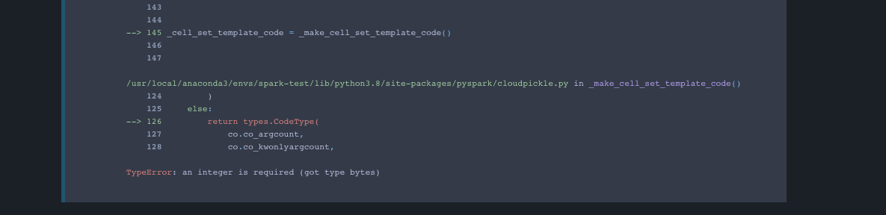
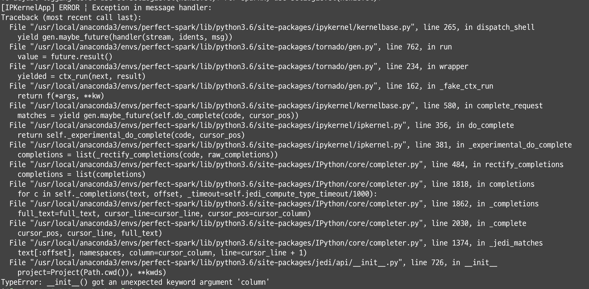
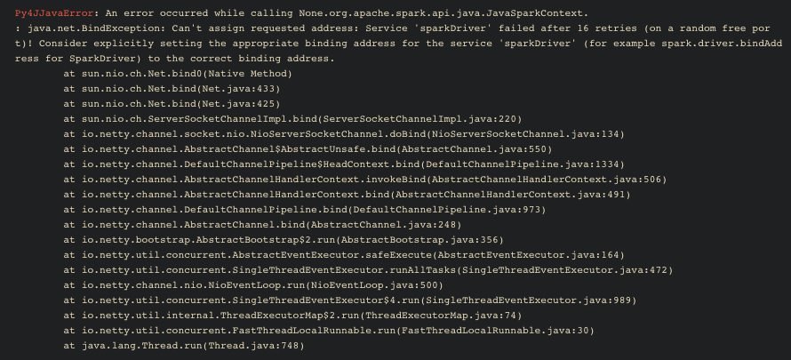

# 0주차 정리

- [0주차 정리](#0주차-정리)
  - [샘플 코드](#샘플-코드)
  - [환경 설정](#환경-설정)
    - [실습 환경](#실습-환경)
    - [패키지 설치](#패키지-설치)
  - [pyspark 설치 삽질](#pyspark-설치-삽질)
  - [jupyter auto-complete (tab 기능) 에러 수정](#jupyter-auto-complete-tab-기능-에러-수정)
  - [ERROR SparkContext: Error initializing SparkContext](#error-sparkcontext-error-initializing-sparkcontext)

## 샘플 코드

- [샘플코드](./sample.ipynb) 에서 확인 가능합니다.

## 환경 설정

### 실습 환경

> 자세한 패키지 버전들은 [requirements.txt](./requirements.txt) 에서 확인 가능합니다.

- macOS Catalina 10.15.7
- Anaconda (conda 4.7.12)
- Python 3.6.12
- pyspark 2.4.7
- Jupyter
- jupyter-themes
- jedi

> 주피터 테마를 바꾸고 싶으시면 [jupyter-themes](https://github.com/dunovank/jupyter-themes)의 리드미를 가볍게 읽어보세요.

### 패키지 설치

아래의 삽집을 경험하기 싫으시면 해당경로에 있는 `requirements.txt` 파일을 다음과 같이 한꺼번에 설치하실 수 있습니다.

```sh
pip install -r requirements.txt
```

## pyspark 설치 삽질

**pyspark 2.4.7 은 python 3.7 이하에서만 호환이 됩니다.**  
저처럼 3.8에서 설치하셔서 실행하시면...



이런 `TypeError: an integer is required (got type bytes)` 에러를 보실 수 있습니다.

## jupyter auto-complete (tab 기능) 에러 수정

탭을 입력하였더니 다음과 같은 에러를 만났습니다.



읽어보니 자동 완성에 대한 에러가 있는 것 같아, 이슈를 뒤적거려보니... [다음 이슈](https://github.com/jupyter/notebook/issues/5925) 를 주피터에서 찾을 수 있었습니다.

auto-completion 툴인 jedi를 pip로 설치하시면 됩니다.

```sh
pip install jedi==0.17.1
```

## ERROR SparkContext: Error initializing SparkContext

하이고 이번엔 이런 에러를 만났습니다.



찾아보니 ([레퍼런스](https://comafire.github.io/posts/2020-pyspark-macos-bind-error/)) 스파크 아이피가 환경변수에 제대로 잡혀있지 않아 바인딩이 안되어 생기는 문제로 알게되었습니다.

다음과 같이 샘플코드에 환경변수를 주입할 수 있지만, 일반적으로 OS에 환경변수를 등록해서 사용하시는 것을 권장합니다.

```py
import os
os.environ["SPARK_LOCAL_IP"] = "127.0.0.1"
```
