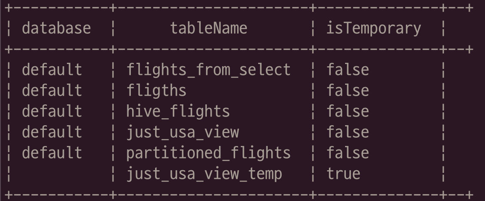

# Spark SQL

## 10.1 SQL?

- SQL(Structured Query Language): 구조적 질의 언어는 데이터에 대한 관계형 연산을 표현하기 위한 도메인 특화 언어(RDBMS에서 사용된다).

## 10.2 빅데이터와 SQL: Apache Hive

## 10.3 빅데이터와 SQL: Spark SQL

### 10.3.1 스파크와 하이브의 관계

- 스파크 SQL은 하이브 메타스토어를 사용한다.
  - 스파크 SQL은 조회할 파일 수를 최소화하기 위해 하이브 메타스토어에 메타데이터를 참조한다.

#### Hive metastore

- 설정
  - `spark.sql.hive.metastore.version`
  - `spark.sql.hive.metastore.jars`

## 10.4 스파크 SQL 쿼리 실행 방법

### 10.4.2 스파크의 프로그래밍 SQL 인터페이스

- 스파크에서 지원하는 언어 API로 비정형 SQL 실행.
- SparkSession 객체의 sql 메서드 사용하며, 결과는 **DataFrame**로 반환된다.

```
spark.sql("SELECT 1 + 1").show()
```

- dataframe을 반환하며, 지연 처리된다.

```
spark.sql("""SELECT user_id, department, first_name FROM professors
    WHERE department IN
        (SELECT name FROM department WHERE created_date >= '2016-01-01')""")
```

- 여러 줄로 구성된 문자열(query 문)을 전달 할 수 있다.
- **SQL과 DataFrame은 완벽하게 연동될 수 있다.**

### 10.4.3 스파크 SQL 쓰리프트 JDBC/ODBC 서버

- 스파크는 JDBC(Java Database Connectivity)를 제공한다.

## 10.5 카탈로그(Catalog)

- 스파크 SQL에서 가장 높은 추상화 단계.
- 데이터에 대한 메타데이터, 데이터베이스, 테이블, 함수 그리고 뷰에 대한 정보를 추상화.
- `org.apache.spark.sql.catalog.Catalog` 패키지로 사용 가능.
- 카탈로그는 테이블, 데이터베이스, 그리고 함수를 조회하는 등 유용한 함수를 제공.
- 스파크 SQL을 사용하는 또 다른 방식의 프로그래밍 인터페이스.

## 10.6 테이블

- 테이블: 명령을 실행할 데이터의 구조(DataFrame과 논리적으로 동일).
- 테이블은 **데이터베이스**에서 정의합니다. (기본적으로 default 데이터베이스 사용)
- 테이블을 제거하면, **테이블의 모든 데이터가 제거되므로 주의**

### 10.6.1 스파크 관리형 테이블

- 테이블에는 데이터와 테이블에 대한 데이터, **메타데이터**가 저장된다.

#### 테이블 종류

- 관리형 테이블
- 외부 테이블
  - 디스크에 저장된 파일을 이용해 테이블을 정의하면 외부 테이블을 정의하는 것이다.

### 10.6.2 테이블 생성하기

- 스파크는 SQL에서 전체 데이터 소스 API를 재사용할 수 있는 독특한 기능을 지원.
- 테이블을 정의한 다음 테이블에 데이터를 적재할 필요가 없다.
- CTAS(Create Table As ... Select ...) 패턴
  - 특정 테이블에서 원하는 row 혹은 column 을 추출하여 새로운 테이블 생성
  ```
  CREATE TABLE flights_from_select USING parquet AS SELECT * FROM flights
  ```
- `CREATE TABLE IF NOT EXISTS * `와 같이 \
  IF NOT EXISTS 구문을 사용해, 테이블이 없는 경우에만 생성할 수도 있다.
- 파티셔닝된 데이터셋 활용

```
CREATE TABLE partitioned_flights USING parquet PARTITIONED BY (DEST_COUNTRY_NAME)
AS SELECT DEST_COUNTRY_NAME, ORIGIN_COUNTRY_NAME, count FROM flights LIMIT 5
```

- **스파크에 접속한 세션에서도 생성된 테이블**을 사용할 수 있다.

### 10.6.3 외부 테이블 생성하기

- 외부 테이블: 스파크가 테이블의 메타데이터는 관리하지만, \
  데이터 파일은 관리하지 않는 테이블.
- 대부분의 Hive 쿼리문을 스파크 SQL에서 바로 사용할 수 있다. \
  (외부테이블은 Hive에서 지원하는 테이블 중 하나이다.)

```
CREATE EXTERNAL TABLE hive_flights (
  DEST_COUNTRY_NAME STRING, ORIGIN_COUNTRY_NAME STRING, count LONG)
 ROW FORMAT DELIMITED FIELDS TERMINATED BY ',' LOCATION 'data/flight-data-hive/'
```

- SELECT query 결과로, 외부 테이블 생성.

```
CREATE EXTERNAL TABLE hive_flights_2
ROW FORMAT DELIMITED FIELDS TERMINATED BY ','
LOCATION '../week4/youn/data/flight_data
```

### 10.6.4 테이블에 데이터 삽입하기

- 데이터 삽입은 표준 SQL 문법을 따른다.

```
INSERT INTO flights_from_select
  SELECT DEST_COUNTRY_NAME, ORIGIN_COUNTRY_NAME, count FROM flights LIMIT 20
```

- 파티셔닝 스키마에 맞게 데이터를 저장한다. (특정 파티션에만 저장할 수 있다.)

```
INSERT INTO partitioned_flights
  PARTITION (DEST_COUNTRY_NAME="UNITED STATES")
  SELECT count, ORIGIN_COUNTRY_NAME FROM flights
  WHERE DEST_COUNTRY_NAME='UNITED STATES' LIMIT 12
```

### 10.6.5 테이블 메타데이터 확인하기

- `DESCRIBE TABLE {table_name}`: 테이블의 메타데이터 정보를 반환.
- `SHOW PARTITIONS {table_name}`: 파티셔닝 스키마 정보 출력.

### 10.6.6 테이블 메타데이터 갱신하기

- 테이블의 메타데이터를 유지하는 것은 가장 최신의 데이터셋을 읽고 있다는 것을 보장한다.
- `REFRESH TABLE {table_name}`: 테이블과 관련된 모든 캐싱된 항목(파일 등)을 갱신.
- `MSCK REPAIR TABLE {table_name}`: **카탈로그에서 관리하는 테이블의 파티션** 정보를 새로 고친다.

### 10.6.7 테이블 제거하기

- 테이블은 **삭제**할 수 없고, 제거(drop)만 할 수 있습니다.
- 관리형 테이블을 삭제할 경우, **데이터와 테이블 정의** 모두 제거된다.
- 외부 테이블을 제거하면, **데이터는 삭제되지 않고 정의만 삭제**된다.

```
DROP TABLE {table_name};
DROP TABLE IF EXISTS {table_name};
```

### 10.6.8 테이블 캐싱하기

- 테이블 캐시 및 캐시에서 제거

```
CACHE TABLE flights;
UNCACHE TABLE flights;
```

## 10.7 뷰

- 뷰
  - 기존 테이블에 여러 트랜스포메이션 작업을 지정.
  - 단순 쿼리 실행 계획
  - 쿼리 로직 체계화 및 재사용성 증대.
  - 전역 뷰 / 세션별 뷰

### 10.7.1 뷰 생성하기

- 쿼리 시점에 데이터소스에 트랜스포메이션을 수행.

```
CREATE VIEW just_usa_view AS
  SELECT * FROM flights WHERE dest_country_name = 'United States'
```

- 임시뷰
  - 세션별 임시뷰(TEMP VIEW): 데이터베이스에 등록되지 않고, 현재 세션에서만 사용할 수 있는 뷰.
  - 전역 임시뷰(GLOBAL TEMP VIEW): 데이터베이스 상관 없이, 사용할 수 잇는 뷰 (세션 종료시 삭제)

```
CREATE TEMP VIEW just_usa_view_temp AS
  SELECT * FROM flights WHERE dest_country_name = 'United States'


CREATE GLOBAL TEMP VIEW just_usa_global_view_temp AS
  SELECT * FROM flights WHERE dest_country_name = 'United States'

SHOW TABLES
```



- `CREATE OR REPLACE`를 사용해 생성된 뷰를 덮어쓸 수도 있다.
- 생성된 뷰는 다른 테이블과 동일한 방식으로 이용이 가능하다.
  - `SELECT * FROM just_usa_view_temp`
- 뷰는 실질적으로 트랜스포메이션이며, \
  **스파크는 쿼리가 실행될 때만 뷰에 정의된 트랜스포메이션을 수행**합니다.
- 스파크 DataFrame과 스파크 SQL로 생성된 쿼리 실행 계획(`EXPLAIN` 사용)을 비교하면 확인이 두 연산이 동일한 것을 확인 할 수 있다.

### 10.7.2 뷰 제거하기

- 뷰를 제거하면, 데이터는 제거되지 않으며 뷰의 정의만 제거된다.

```
DROP VIEW IF EXISTS {view_name};
```

## 10.8 데이터 베이스

- 데이터베이스는 여러 테이블을 조직화하기 위한 도구.
- 스파크에서 실행하는 모든 SQL문은 사용 중인 데이터베이스 범위에서 실행된다.
- 데이터베이스를 변경하면, 이전에 생성한 테이블은 변경하기전의 데이터베이스에 속해 있으므로 조회시 에러가 날 수 있다.

- 데이터 베이스 목록 조회 / 생성 / 설정 / 사용중인 데이터 조회 / 제거

```
SHOW DATABASES;

CREATE DATABASE {some_db};

USE {some_db};

SELECT current_database();

DROP DATABASE IF EXISTS {some_db};
```

- 접두사를 통해 테이블의 데이터베이스를 지정할 수 있다.

```
SELECT * FROM {some_db}.{some_table};
```

## 10.9 SELECT 구문

- ANSI-SQL 요건 충족

### 10.9.1 case...when...then 구문

- 조건에 따라서 쿼리값을 변경.

```
SELECT
  CASE WHEN DEST_COUNTRY_NAME = 'UNITED STATES' THEN 1
       WHEN DEST_COUNTRY_NAME = 'Egypt' THEN 0
       ELSE -1 END
  FROM partitioned_flights
```

## 고급 주제

### 10.10.1 복합 데이터 타입

- 표준 SQL에는 존재하지 않는 타입
- 구조체, 리스트, 맵 존재.

#### 구조체

- 중첩 데이터 생성 및 쿼리하는 방법을 제공.
- `(column1, column2)`: 여러 columns 혹은 표현식을 `()`로 감싸면 구조체가 된다.
- `.(dot)`을 이용하면 구조체의 개별 컬럼을 조회할 수 있다.

```
CREATE VIEW IF NOT EXISTS nested_data AS
  SELECT (DEST_COUNTRY_NAME, ORIGIN_COUNTRY_NAME) as country, count FROM flights

SELECT * FROM nested_data

SELECT * country.DEST_COUNTRY_NAME, count FROM nested_data

SELECT country.*, count FROM nested_data
```

#### 리스트

-

### 10.10.2 함수

### 10.10.3 서브쿼리

#### 비상호연관 조건절 서브쿼리

#### 상호연관 조건절 서브쿼리

#### 비상호연관 스칼라 쿼리

## 10.11 다양한 기능

##

- ANSI SQL:2003
- TPC-DS
- tm

## Questions

1. db를 제거하는 경우, db에 저장된 테이블 및 테이블에 저장된 데이터도 삭제되는가?
2. 현재도 표준 SQL에서는 복합 데이터 타입이 존재하지 않는가?
