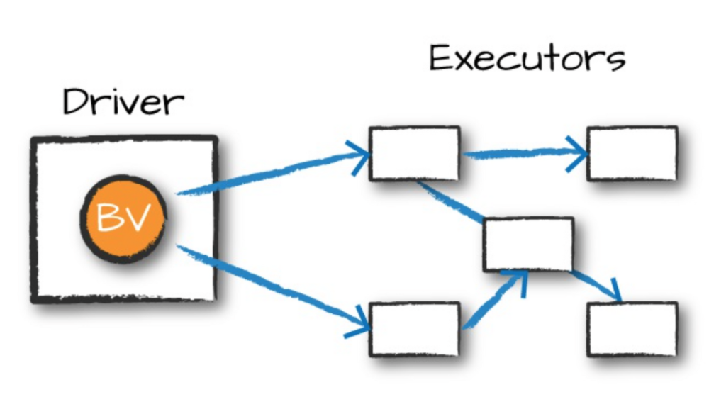

# 14. Distributed Shared Variables

## 14.1 Broadcast Variable

- 스파크 잡이 실행되는 동안 클러스터 내의 모든 서버(?)에서 공유할 수 있는 읽기 전용 자원을 설정.
- 브로드캐스트 변수는 변하지 않는 값(불변성 값)을 클로저 함수의 변수로 캡슐화 하지 않고, 클러스터에서 효율적으로 공유하는 방법을 제공합니다.
  - task에서 driver 노드의 변수를 사용할 때는 태스크의 수 만큼 워커 노드로 전송해야함.
  - broadcast 변수는 driver 노드에서 executor 노드에 한번만 배포하여 일련의 스테이지에 걸쳐 재사용 가능. (동일 스테이지 내에서 다른 태스크에서는 브로드캐스트 변수가 아니어도 재사용)
  - 효율적으로 데이터를 전송할 수 있어서, 직렬화와 역직렬화에 대한 부하를 줄일 수 있다.
- read-only shared variables that are cached and available on all nodes in a cluster in order to access or use by the tasks

### 직렬화(Serialization) and 역직렬화(Deserialization)

#### 직렬화(Serialization)

- Object를 Byte 형태로 변환하는 작업.
- Network 상에서 데이터를 전송하기 위한 작업.
  - Spark Driver -> Spark Executor로 작업과 Data 배분

#### 역직렬화(Deserialization)

- Byte를 Object로 변환하는 작업.

- 참고
  - https://learning-sarah.tistory.com/entry/%EC%A0%80%EC%88%98%EC%A4%80-API-RDD

## 14.2 어큐뮬레이터(Accumulator)

- 클러스터 내의 모든 서버에서 공유할 수 있는 쓰기 공간 제공.
- 트랜스포메이션 내부의 다양한 값을 갱신하는 데 사용.
  - 로우 단위로 안전하게 값을 갱신할 수 있는 변경 가능한 변수를 제공.
  - 디버깅용 혹은 저수준 집계 생성용(파티션별로 특정 변수의 값을 추적하는 용도)
- 어큐뮬레이터는 결합성(결합법칙)과 가환성(교환법칙)을 가진 연산만 사용가능하므로 **병렬** 처리가 가능하다.
- 기본적으로 **수치형**을 제공하며, **사용자 정의** 어큐뮬레이터도 만들 수 있다.
- 액션을 처리하는 과정에서만 갱신되며, 태스크 당 1번만 갱신되므로 재시작한 태스크에서는 갱신되지 않는다.

## Jobs, Stages, Tasks

- 액션 하나당 하나의 job이 생긴다.
- 하나의 job은 일련의 스테이지로 이루어진다.
- 스테이지는 여러개의 태스크로 이루어진다.
- task는 단일 익스큐터에서 실행할 데이터의 블록(다수의 파티션)과 다수의 트랜스포메이션의 조합.
