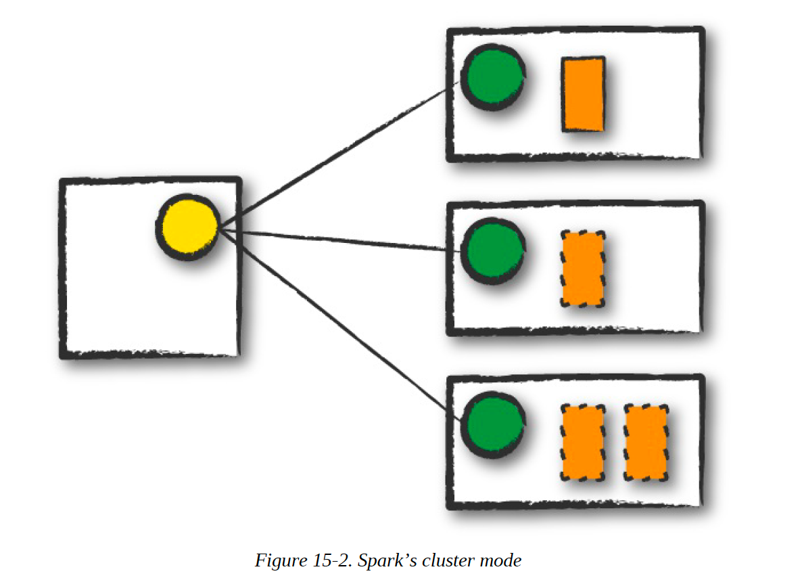
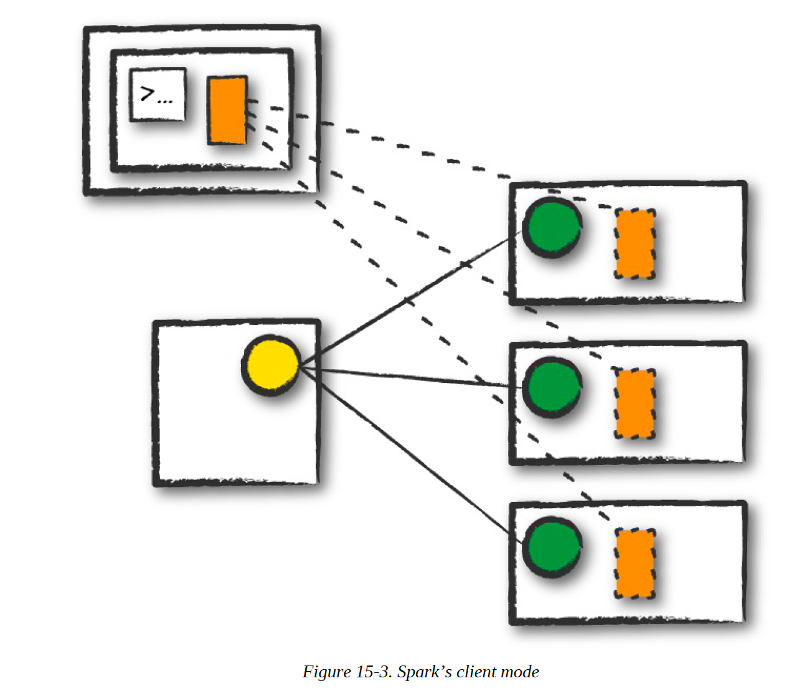
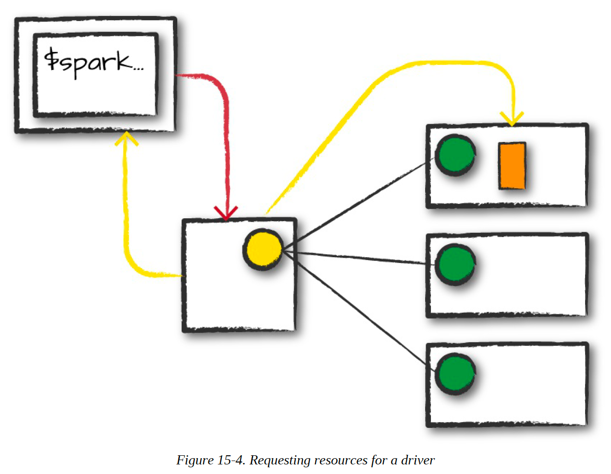
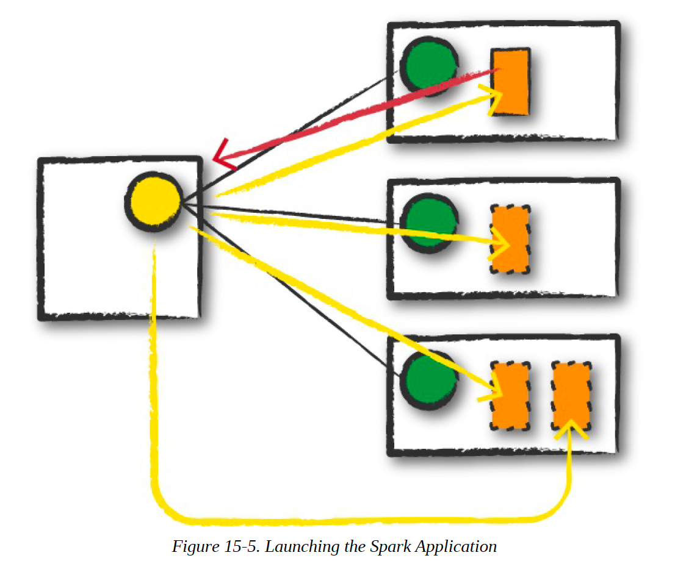
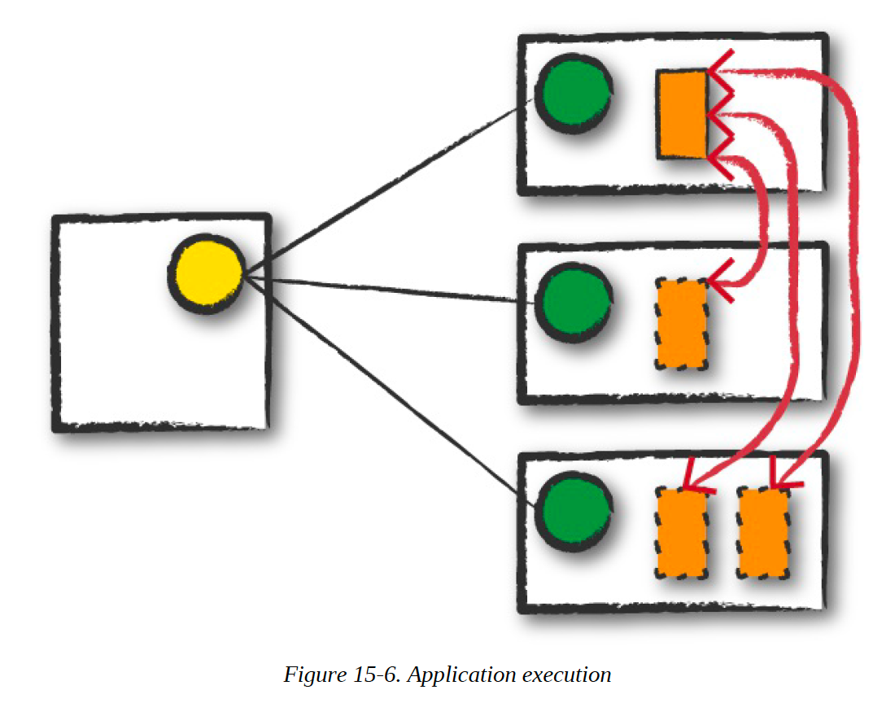
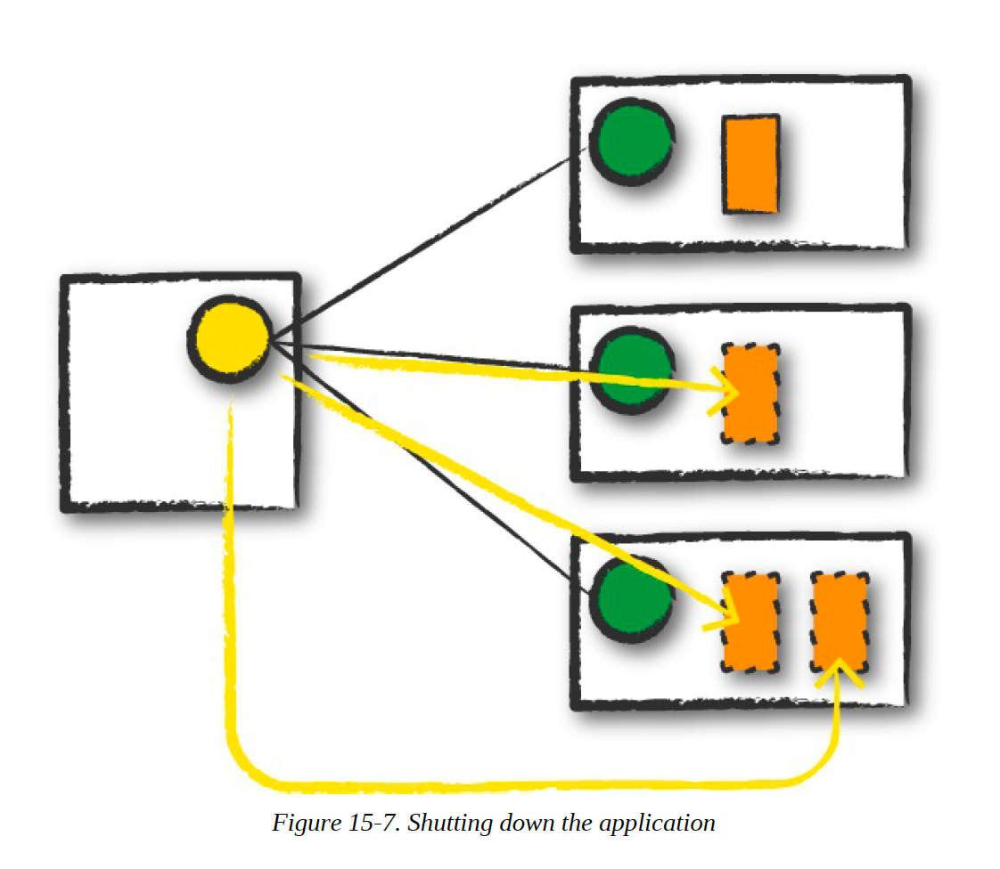
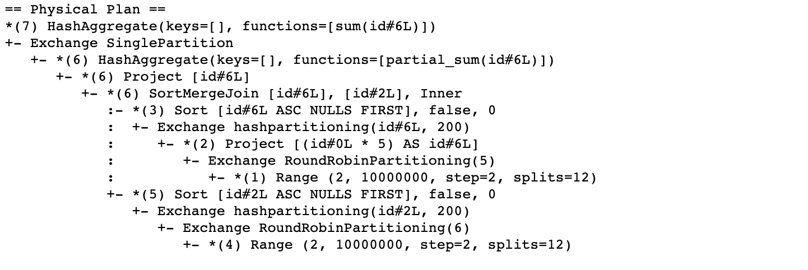
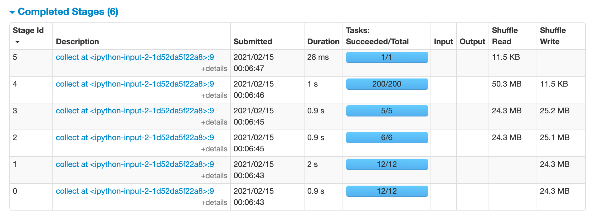

# 설명할 주제
* 스파크 드라이버 / 익스큐터 프로세스 및 클러스터 매니저의 역할.
* 스파크 애플리케이션의 생애주기.

# The Architecture of a Spark Application

## 클러스터 매니저
 
* 스파크 애플리케이션을 실행할 클러스터 머신을 유지한다.
* 클러스터 매니저는 드라이버와 워커 노드를 가진다. \
(스파크의 드라이버 프로세스와는 분리되는 개념)
* 원은 노드를 관리하는 데몬 프로세스를 의미한다.

### 실행 모드
* 실행 모드는 애플리케이션을 실행할 때, **요청한 자원의 물리적인 위치를 결정**한다.
* 실행 모드 종류
  - 클러스터 모드
  - 클라이언트 모드
  - 로컬 모드

### 클러스터 모드
* 클러스터 매니저가 **워커 노드에서 드라이버와 익스큐터 프로세스**를 **모두** 실행하는 모드.



(실선의 주황색 사각형은 드라이버 프로세스를 의미하며, 점선의 주황색 사각형은 익스큐터 프로세스를 의미한다.)

### 클라이언트 모드
* 스파크 드라이버는 애플리케이션을 제출한 클라이언트 머신에서, \
익스큐터는 클러스터의 워커노드에서 실행하는 모드.
* 클러스터와 무관하며, 스파크 드라이버 프로세스가 실행되는 머신을 **게이트웨이 머신** 혹은 **에지 노드**라고 합니다.



### 로컬 모드
* 클러스터를 사용하지 않고, \
모든 스파크 애플리케이션이 **단일 머신에서 실행**되는 모드.
* 병렬 처리를 위해 프로세스가 아닌, 스레드를 활용
* 테스트 및 개발 용도

## 스파크 애플리케이션의 생애주기(스파크 외부)
* 클러스터 관점에서 살펴보는 생애주기
* spark-submit 명령으로 스파크 애플리케이션을 실행하는 예제
* 하나의 드라이버 노드와 세 개의 워커 노드로 구성된 클러스터 및 클러스터 모드로 실행한다고 가정.

### 단계







1. 스파크 애플리케이션 **제출**(클라이언트 요청)
    - 로컬에서 코드가 실행되어 클러스터 드라이버 노드에 스파크 드라이버 프로세스 자원을 포함하여 요청.
    - 클러스터 매니저는 클러스터 노드 중 하나에서 드라이버 프로세스를 실행.
    - 스파크 애플리케이션을 제출한 프로세스 종료.
1. 스파크 애플리케이션 **시작**
    - SparkSession을 생성하고, SparkSession은 클러스터 매니저와 통신해서 **스파크 익스큐터 실행**을 요청.
    - SparkSession은 스파크 클러스터(스파크 드라이버 및 익스큐터)를 초기화한다.
    - 클러스터 매니저는 익스큐터 프로세스를 시작하고, **익스큐터의 위치와 관련된 정보**를 드라이버 프로세스에 전달한다.
2. 스파크 애플리케이션 **실행**
    - 드라이버는 각 워커에 태스크를 할당하고, 워커는 태스크의 상태와 성공/실패 여부를 드라이버에 전송.
3. 스파크 애플리케이션 **완료**
    - 드라이버 프로세스가 종료되고, 클러스터 매니저가 스파크 클러스터의 모든 익스큐터를 종료시킨다.
    - 스파크 애플리케이션의 성공/실패 여부는 클러스터 매니저에 요청해 확인가능하다.
   
## 스파크 애플리케이션의 생애주기(스파크 내부)
* 스파크 애플리케이션 **코드** 와 관련.
* 스파크 애플리케이션은 하나 이상의 **스파크 잡**으로 구성되며, 병렬 처리를 제외하면 **차례대로** 실행된다.

### 논리적 명령
* 스파크 코드는 트랜스포메이션과 액션으로 구성.
* 스파크는 논리적 명령을 물리적인 실행 계획으로 변환합니다.

```python
df1 = spark.range(2, 10000000, 2) # DataFrame 생성
df2 = spark.range(2, 10000000, 2)
step1 = df1.repartition(5) # 파티션을 재분배
step12 = df2.repartition(6) 
step2 = step1.selectExpr("id * 5 as id") # 트랜스포메이션
step3 = step2.join(step12, ["id"]) # 트랜스포메이션
step4 = step3.selectExpr("sum(id)") # 트랜스포메이션

step4.collect() # 액션
```





* stage0: task 12
* stage1: task 12
* stage2: task 6
* stage3: task 5
* stage4: task 200
* stage5: task 1

### 스파크 잡
* collect와 같은 액션 하나당 하나의 스파크 잡이 생성되며, 액션은 항상 결과를 반환한다.
* 스파크 잡은 스테이지로 나뉜다.
  
### 스테이지
* 셔플을 하는 넓은 트랜스포메이션에 의해 생성.
* 다수의 머신에서 셔플이 없이 동일한 연산을 수행하는 태스크의 그룹
* 스파크는 가능한 많은 태스크를 하나의 스테이지로 묶으려고 한다.
* 셔플 작업 후에는 새로운 스테이지를 시작.
  - 셔플: 데이터의 물리적 재분배 과정으로, 익스큐터 프로세스간의 데이터 이동이 발생.
  - spark.sql.shuffle.partition: 셔플시 생성되는 파티션의 수. (default: 200)

### 태스크
* 단일 익스큐터에서 실행할 하나의 파티션과 다수의 좁은 트랜스포메이션 조합